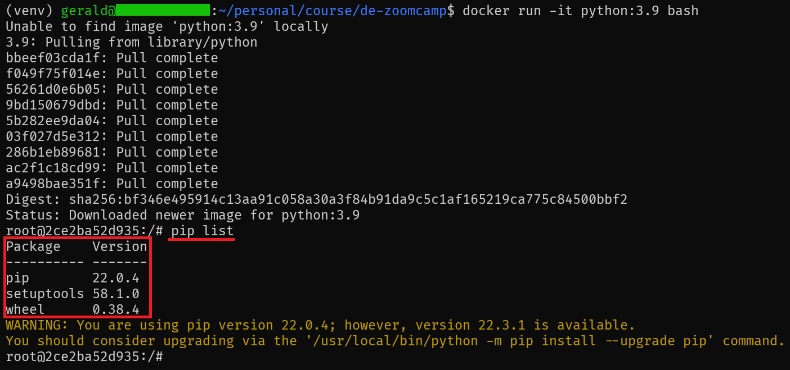

## Week 1 Homework

> **This is the answer for my Week 1 Homework. For question 3 to question 6
> , you may refer to [sql code](week1_homework.sql) or this markdown document.**

In this homework we'll prepare the environment
and practice with Docker and SQL

## Question 1. Knowing docker tags

Run the command to get information on Docker

`docker --help`

Now run the command to get help on the "docker build" command

Which tag has the following text? - _Write the image ID to the file_

- `--imageid string`
- `--iidfile string` ✅
- `--idimage string`
- `--idfile string`

## Answer 1


## Question 2. Understanding docker first run

Run docker with the python:3.9 image in an iterative mode and the entrypoint of bash.
Now check the python modules that are installed ( use pip list).
How many python packages/modules are installed?

- 1
- 6
- 3 ✅
- 7

## Answer 2



# Prepare Postgres

Run Postgres and load data as shown in the videos
We'll use the green taxi trips from January 2019:

`wget https://github.com/DataTalksClub/nyc-tlc-data/releases/download/green/green_tripdata_2019-01.csv.gz`

You will also need the dataset with zones:

`wget https://s3.amazonaws.com/nyc-tlc/misc/taxi+_zone_lookup.csv`

Download this data and put it into Postgres (with jupyter notebooks or with a pipeline)

## Question 3. Count records

How many taxi trips were totally made on January 15?

Tip: started and finished on 2019-01-15.

Remember that `lpep_pickup_datetime` and `lpep_dropoff_datetime` columns are in the format timestamp (date and hour+min+sec) and not in date.

- 20689
- 20530 ✅
- 17630
- 21090

## Answer 3

```sql
select count(1)
from green_tripdata_201901
where lpep_pickup_datetime::date = '2019-01-15'
	and lpep_dropoff_datetime::date = '2019-01-15';
```

## Question 4. Largest trip for each day

Which was the day with the largest trip distance
Use the pick up time for your calculations.

- 2019-01-18
- 2019-01-28
- 2019-01-15 ✅
- 2019-01-10

## Answer 4

```sql
select
	lpep_pickup_datetime::date as pickup_time,
	max(trip_distance) as largest_trip_distance
from green_tripdata_201901
group by 1
order by 2 desc
limit 1;
```

## Question 5. The number of passengers

In 2019-01-01 how many trips had 2 and 3 passengers?

- 2: 1282 ; 3: 266
- 2: 1532 ; 3: 126
- 2: 1282 ; 3: 254 ✅
- 2: 1282 ; 3: 274

## Answer 5

```sql
select
	passenger_count,
	count(1) as trip_count
from green_tripdata_201901
where lpep_pickup_datetime::date = '2019-01-01'
group by 1
having passenger_count in (2, 3);
```

## Question 6. Largest tip

For the passengers picked up in the Astoria Zone which was the drop up zone that had the largest tip?
We want the name of the zone, not the id.

Note: it's not a typo, it's `tip` , not `trip`

- Central Park
- Jamaica
- South Ozone Park
- Long Island City/Queens Plaza ✅

## Answer 6

```sql
select
	coalesce(dropoff."Zone", 'Unknown') as dropoff_zone,
	max(tip_amount) as largest_tip
from green_tripdata_201901 taxi
left join zone pickup on taxi."PULocationID" = pickup."LocationID"
left join zone dropoff on taxi."DOLocationID" = dropoff."LocationID"
where pickup."Zone" = 'Astoria'
group by 1
order by largest_tip desc
limit 1;
```
