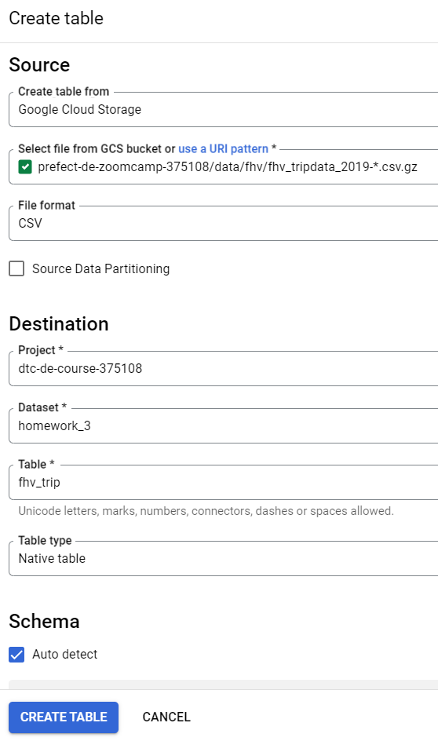

## Week 3 Homework

### Load fhv 2019 data into gcs
> ⚠ Make sure you start the prefect orion server
> ```
> prefect orion start
> ```

```
python3 flows/etl_web_to_gcs.py
```

### Create external table using the fhv 2019 data in gcs
```sql
create or replace external table `dtc-de-course-375108.homework_3.fhv_trip_external`
options (
  uris = ['gs://prefect-de-zoomcamp-375108/data/fhv/fhv_tripdata_2019-*.csv.gz'],
  format = 'CSV'
);
```

### Create table in BQ


## Question 1:
What is the count for fhv vehicle records for year 2019?
- 65,623,481
- 43,244,696 ✅
- 22,978,333
- 13,942,414

## Answer 1
```sql
select count(1) from `dtc-de-course-375108.homework_3.fhv_trip`;
```

## Question 2:
Write a query to count the distinct number of affiliated_base_number for the entire dataset on both the tables.</br> 
What is the estimated amount of data that will be read when this query is executed on the External Table and the Table?

- 25.2 MB for the External Table and 100.87MB for the BQ Table
- 225.82 MB for the External Table and 47.60MB for the BQ Table
- 0 MB for the External Table and 0MB for the BQ Table
- 0 MB for the External Table and 317.94MB for the BQ Table ✅


## Question 3:
How many records have both a blank (null) PUlocationID and DOlocationID in the entire dataset?
- 717,748 ✅
- 1,215,687
- 5
- 20,332

## Question 4:
What is the best strategy to optimize the table if query always filter by pickup_datetime and order by affiliated_base_number?
- Cluster on pickup_datetime Cluster on affiliated_base_number
- Partition by pickup_datetime Cluster on affiliated_base_number ✅
- Partition by pickup_datetime Partition by affiliated_base_number
- Partition by affiliated_base_number Cluster on pickup_datetime

## Question 5:
Implement the optimized solution you chose for question 4. Write a query to retrieve the distinct affiliated_base_number between pickup_datetime 03/01/2019 and 03/31/2019 (inclusive).</br> 
Use the BQ table you created earlier in your from clause and note the estimated bytes. Now change the table in the from clause to the partitioned table you created for question 4 and note the estimated bytes processed. What are these values? Choose the answer which most closely matches.
- 12.82 MB for non-partitioned table and 647.87 MB for the partitioned table
- 647.87 MB for non-partitioned table and 23.06 MB for the partitioned table ✅
- 582.63 MB for non-partitioned table and 0 MB for the partitioned table
- 646.25 MB for non-partitioned table and 646.25 MB for the partitioned table


## Question 6: 
Where is the data stored in the External Table you created?

- Big Query
- GCP Bucket ✅
- Container Registry
- Big Table


## Question 7:
It is best practice in Big Query to always cluster your data:
- True ✅
- False


## (Not required) Question 8:
A better format to store these files may be parquet. Create a data pipeline to download the gzip files and convert them into parquet. Upload the files to your GCP Bucket and create an External and BQ Table. 


Note: Column types for all files used in an External Table must have the same datatype. While an External Table may be created and shown in the side panel in Big Query, this will need to be validated by running a count query on the External Table to check if any errors occur. 

